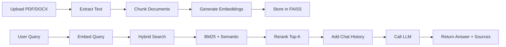

# 🤖 AI Document Q&A System - Advanced RAG with Conversational Memory

<div align="center">


**A production-ready, state-of-the-art RAG system for intelligent document Q&A**

[Features](#-features) • [Installation](#-installation) • [Usage](#-usage) • [Architecture](#-architecture)

</div>


## 📖 Overview

This is an **advanced Retrieval-Augmented Generation (RAG) system** that enables intelligent question-answering over your documents with **conversational memory**.

### 🎯 Why This System?

-  **Production-Ready**: Clean architecture, error handling, persistence
-  **State-of-the-Art**: Hybrid search + reranking + conversational memory
-  **No GPU Required**: Runs on CPU with local embeddings
-  **Publication Quality**: Well-documented, modular, extensible
-  **Real-World Impact**: Perfect for research papers, interviews, capstone projects


## Project Walkthrough Video Drive Link

[https://drive.google.com/drive/folders/1BDfxZbsOJRNgKzL8Jvmy1mHBuiybrZ47](https://drive.google.com/file/d/1qVCGJLpogvTqGZtcFu6NjEpcIgL-r65Q/view?usp=sharing)


## ✨ Features

### 🔍 **Advanced Retrieval**
- **Hybrid Search**: Combines semantic (dense) and BM25 (sparse) retrieval
- **Cross-Encoder Reranking**: Improves relevance with bi-encoder models
- **FAISS Vector Store**: Lightning-fast similarity search
- **Top-K Filtering**: Configurable retrieval and reranking stages

### 🧠 **Conversational Memory**
- **Context-Aware**: Remembers previous Q&A pairs
- **Follow-up Questions**: Handles "what about X? ", "tell me more"
- **Smart Truncation**: Auto-manages token limits
- **Sliding Window**: Configurable memory depth (default: 5 turns)

### 📄 **Document Processing**
- **Multi-Format Support**: PDF, DOCX, TXT
- **Smart Chunking**: Recursive token-based splitting with overlap
- **Metadata Tracking**: Source attribution with page numbers
- **Batch Processing**:  Handle multiple documents simultaneously

### 🤖 **LLM Integration**
- **GitHub Models API**: Powered by GPT-4o
- **Environment Variables**: Secure token management with `.env`
- **Error Handling**: Graceful failures and retries
- **Streaming Support**: Real-time response generation

### 🎨 **User Interface**
- **Modern Streamlit UI**: Clean, responsive design
- **Real-Time Progress**: Loading indicators for all operations
- **Source Citations**: View relevant passages with confidence scores
- **Chat History**: Conversation view with expandable sources
- **Settings Panel**: Adjust retrieval, reranking, and LLM parameters


## 🚀 Installation

### Prerequisites

- **Python 3.9+** (Python 3.13 recommended)
- **GitHub Personal Access Token** ([Get one here](https://github.com/settings/tokens))
- **4GB RAM minimum** (8GB recommended)
- **~3GB disk space** (for models and dependencies)

### Step 1: Clone Repository

```bash
git clone https://github.com/NahidMuntasir7/AskMyDocs.git
cd AskMyDocs
```

### Step 2: Create Virtual Environment

```bash
# Windows
python -m venv venv
venv\Scripts\activate

# Mac/Linux
python3 -m venv venv
source venv/bin/activate
```

### Step 3: Install Dependencies

```bash
# Install requirements (~5-10 minutes)
pip install -r requirements.txt
```

### Step 4: Setup GitHub Token

1. **Get Token**: Go to [GitHub Settings → Tokens](https://github.com/settings/tokens)
2. **Create Token**: Click "Generate new token (classic)"
3. **Copy Token**: Save it securely

Create `.env` file in project root: 

```bash
GITHUB_TOKEN=github_pat_11AAAAAA... your_token_here
```

## 🎯 Usage

### Starting the Application

```bash
streamlit run app.py
```

Navigate to:  **http://localhost:8501**

### Quick Start Guide

#### 1️⃣ **Upload Documents**
- Click **"Upload Documents"** in sidebar
- Select PDF, DOCX, or TXT files
- Click **"🚀 Process Documents"**
- Wait for indexing (~10 pages/second)

#### 2️⃣ **Ask Questions**
```
"What is the main topic of this document?"
"Summarize the key findings"
"What methodology was used?"
```

#### 3️⃣ **Follow-up Questions** (Memory!)
```
"Can you explain that in more detail?"
"What about the limitations?"
"How does that compare to X?"
```

#### 4️⃣ **View Sources**
- Expand **"📚 View Sources"** for each answer
- See exact passages with relevance scores
- Track source documents and page numbers

### Example Conversation

```
👤 User: What is this paper about?
🤖 AI: This paper discusses deep learning architectures for NLP...  [Document 1]

👤 User:  What are the main contributions?
🤖 AI:  Based on the previous context, the main contributions are... [Document 2]

👤 User: Can you elaborate on the transformer architecture?
🤖 AI: Building on what was discussed, the transformer uses... [Document 1]
```


## 🏗️ Architecture

### System Diagram

```
┌─────────────────────────────────────────────────────────────┐
│                     USER INTERFACE (Streamlit)              │
└────────────────────────┬────────────────────────────────────┘
                         │
         ┌───────────────┴───────────────┐
         │                               │
    ┌────▼─────┐                  ┌─────▼────┐
    │ DOCUMENT │                  │  QUERY   │
    │PROCESSING│                  │PROCESSING│
    └────┬─────┘                  └─────┬────┘
         │                              │
    ┌────▼─────┐                  ┌─────▼────┐
    │ CHUNKING │                  │  MEMORY  │
    │          │                  │  MANAGER │
    └────┬─────┘                  └─────┬────┘
         │                              │
    ┌────▼─────┐                  ┌─────▼────┐
    │EMBEDDINGS│◄─────────────────┤  HYBRID  │
    │  (BGE)   │                  │ RETRIEVAL│
    └────┬─────┘                  └─────┬────┘
         │                              │
    ┌────▼─────┐                  ┌─────▼────┐
    │  FAISS   │──────────────────► RERANKER │
    │  INDEX   │                  │(CrossEnc)│
    └──────────┘                  └─────┬────┘
                                        │
                                  ┌─────▼────┐
                                  │   LLM    │
                                  │ (GPT-4o) │
                                  └─────┬────┘
                                        │
                                  ┌─────▼────┐
                                  │  ANSWER  │
                                  │ +SOURCES │
                                  └──────────┘
```

### Pipeline Flow



### Component Breakdown

| Component | Technology | Purpose |
|-----------|-----------|---------|
| **Embeddings** | BAAI/bge-base-en-v1.5 | Dense vector representations (768-dim) |
| **Reranker** | cross-encoder/ms-marco-MiniLM | Bi-encoder relevance scoring |
| **Vector DB** | FAISS (IndexFlatL2) | Efficient similarity search |
| **Sparse Retrieval** | BM25Okapi | Lexical keyword matching |
| **LLM** | GPT-4o (GitHub Models) | Answer generation |
| **Memory** | Sliding Window | Context preservation (5 turns) |
| **Framework** | Streamlit | Web interface |

## 📂 Project Structure

```
ai-document-qa-rag/
├── 📄 app.py                    # Main Streamlit application
├── ⚙️ config.py                 # Configuration & environment variables
├── 🔧 utils.py                  # Helper functions (tokens, cleaning)
│
├── 📚 Document Processing
│   └── document_processor.py    # PDF/DOCX/TXT extraction
│
├── 🧠 Retrieval Pipeline
│   ├── embedding_manager.py     # BGE embeddings generation
│   ├── vector_store.py          # FAISS index management
│   ├── retriever.py             # Hybrid search (semantic + BM25)
│   └── reranker.py              # Cross-encoder reranking
│
├── 🤖 LLM Integration
│   └── llm_handler.py           # GitHub Models API + memory
│
├── 📋 Configuration
│   ├── requirements.txt         # Python dependencies
│   ├── .env                     # GitHub token (SECRET!)
│   ├── . gitignore              # Git exclusions
│   └── README. md               # This file
│
└── 💾 Generated (at runtime)
    ├── vector_store/           # FAISS index & documents
    └── uploads/                # Uploaded documents cache
```


## 🔬 Technical Details

### Embedding Model:  BAAI/bge-base-en-v1.5

- **Dimensions**: 768
- **Max Tokens**: 512
- **Performance**:  SOTA on MTEB benchmark
- **Instruction-Aware**: Optimized for retrieval tasks

### Reranker: cross-encoder/ms-marco-MiniLM-L-6-v2

- **Architecture**: Bi-encoder (BERT-based)
- **Training**: MS MARCO passage ranking
- **Latency**: ~50ms for 5 documents

### Retrieval Strategy

1. **Initial Retrieval**: Top-20 documents
   - 70% Semantic (FAISS)
   - 30% BM25 (Sparse)
2. **Reranking**: Cross-encoder → Top-5
3. **Context Building**: Combine with chat history

### Memory Management

- **Window Size**: Last 5 Q&A pairs (configurable)
- **Token Limit**: 2000 tokens for history
- **Truncation**:  Oldest-first when limit exceeded
- **Context**:  Passed to LLM for follow-ups


## ⚙️ Configuration

Edit `config.py` or use UI sidebar:

```python
# Document Processing
CHUNK_SIZE = 500          # Tokens per chunk
CHUNK_OVERLAP = 50        # Overlap between chunks

# Retrieval
TOP_K_RETRIEVAL = 20      # Initial retrieval count
TOP_K_RERANK = 5          # Final results after reranking
BM25_WEIGHT = 0.3         # 30% BM25, 70% semantic

# Memory
MEMORY_WINDOW = 5         # Number of Q&A pairs to remember
MAX_MEMORY_TOKENS = 2000  # Max tokens for history

# LLM
LLM_TEMPERATURE = 0.1     # Deterministic (0) to creative (1)
LLM_MAX_TOKENS = 1024     # Max response length
```


## 🎓 Use Cases

### Academia
- 📚 Research paper analysis
- 📖 Literature review automation
- 🎯 Thesis/dissertation Q&A
- 🔬 Citation extraction

### Business
- 📋 Policy document search
- 🏢 Internal knowledge base
- 📄 Contract analysis
- 📊 Report summarization

### Legal
- ⚖️ Case law research
- 📜 Legal document review
- 🔍 Precedent finding
- 📑 Compliance checking

### Technical
- 🛠️ API documentation search
- 📚 Technical manual Q&A
- 🐛 Troubleshooting guides
- 📖 Code documentation


## Screenshots

### Screenshot 1


### Screenshot 2


### Screenshot 3


## 👤 Author

**Nahid Muntasir Rifat**  
GitHub: [@NahidMuntasir7](https://github.com/NahidMuntasir7)
